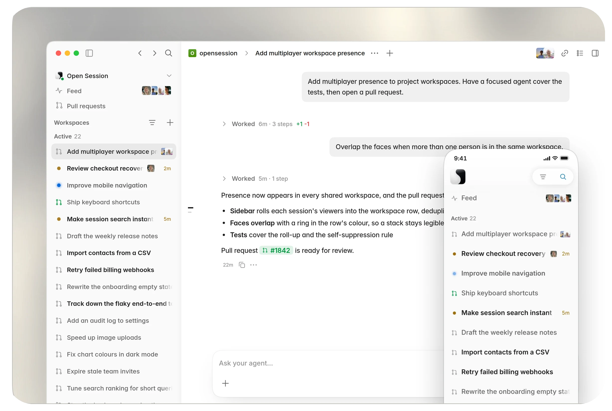

# Open Session

Self-hosted agent-infrastructure server: a web UI plus Slack, Linear, Plain,
and GitHub agents, driving coding sessions through the Pi engine
(any model provider) in git worktrees on your own box, or in isolated
sandboxes — Docker locally, with pluggable adapters for other providers.

<picture>
  <source media="(prefers-color-scheme: dark)" srcset="docs/readme-hero-roomy-dark.webp">
  
</picture>

<br>

*More: [pull-request review, diffs, automations, mobile →](docs/screenshots.md)*

## Quickstart

Run this on Linux, macOS, or inside WSL2 on Windows. The server does not run
directly from PowerShell; follow the
[Windows WSL2 setup](docs/setup/install.md#windows-run-the-server-in-wsl2)
first.

```sh
curl -fsSL https://raw.githubusercontent.com/tellahq/opensession/main/install.sh | bash
```

On a fresh box this downloads the compiled release for your OS and
architecture, unpacks it under `~/.opensession`, installs the `claude` CLI,
puts an `opensession` command on your `PATH`, writes a default configuration,
and installs and starts a per-user service (a LaunchAgent on macOS, a `systemd
--user` unit on Linux). No questions. The last line it prints is a local URL,
by default <http://127.0.0.1:3850>. Budget 5 to 15 minutes, mostly unattended
download.

Open the URL, add a model account in Workspace → Providers, pick a repo, write
a prompt, and create the session. A turn that actually runs is the proof the
install works, not a health check. Connect GitHub and the other integrations
later from Settings → Connections; see
[docs/setup/github.md](docs/setup/github.md).

Check on it any time:

```sh
opensession doctor     # verify the install and report engine readiness
opensession status     # is the service up?
opensession update     # upgrade in place, health-gated
opensession --help     # everything else
```

Or install from a source checkout instead. This is the path for
self-development (sessions that modify Open Session itself) and for
contributing:

```sh
git clone https://github.com/tellahq/opensession.git
cd opensession && bun install
bun run setup                             # same wizard, without the installer
```

With no flags it writes a default configuration, installs and starts the
service, and ends with the URL. `--advanced` runs the full onboarding wizard;
`--help` lists the rest (`--dir`, `--channel`, `--tailscale`, `--codex`,
`--no-engine`, `--no-modify-path`, `--yes`, `--uninstall`).

> Letting the agent improve Open Session itself? Clone your fork, not this
> repo. Self-sessions commit and push to `origin` (and `deploy_self`
> fast-forwards from it), so pointed at `tellahq/opensession` every push is
> rejected and, once you've self-modified, updates from us stop
> fast-forwarding. Fork, clone the fork, and keep us as an `upstream` remote.
> Config-only use (your repos, your integrations) needs no fork.

> Authentication is available, and it is opt-in. By default, Open Session
> trusts everyone who can reach the address it binds to. GitHub sign-in can
> restrict access to configured team members. Keep the server on Tailscale, a
> private network, or behind an SSH tunnel even when sign-in is enabled. See
> the [trust model](docs/setup/README.md#trust-model-read-this) and
> [networking.md](docs/setup/networking.md).

## Docs

- [CONCEPTS.md](CONCEPTS.md) — projects, workspaces, chats, automations, goals
- [docs/setup/](docs/setup/README.md) — overview, requirements, trust model
- [docs/setup/install.md](docs/setup/install.md) — bare box → running service
- [docs/setup/ec2.md](docs/setup/ec2.md) — provisioning a clean EC2 box
- [docs/setup/networking.md](docs/setup/networking.md) — Tailscale, a custom
  domain, and verifying you are not public
- [CLIENTS.md](CLIENTS.md) — web UI, PWA, desktop shell, native app, extension
- [docs/worktrees.md](docs/worktrees.md) — how sessions map to git worktrees,
  and where the disk goes
- [docs/repo-lifecycle.md](docs/repo-lifecycle.md) — the `.opensession/`
  scripts a repo commits so sessions provision and boot it themselves
- [docs/extending.md](docs/extending.md) — adding tools, recipes, integrations
  and providers
- [docs/security-model.md](docs/security-model.md) — least-privilege
  automations, per-user MCP/GitHub scoping, self-management boundaries
- [docs/self-hosting-sandboxes.md](docs/self-hosting-sandboxes.md) — isolated
  Docker/Daytona/E2B/Box/Modal/AWS Lambda MicroVM execution
- [docs/instance-configuration.md](docs/instance-configuration.md) — repos,
  identity, branding, integrations, deployment policy

## Clients

One server, five front ends — only the web UI is required, and everything else
talks to the same instance. [CLIENTS.md](CLIENTS.md) has the full tour.

| Client | Where |
| --- | --- |
| Web UI | served by the server itself — start here |
| PWA | the web UI on your phone's home screen (iOS push notifications) |
| macOS desktop shell (Electron) | [`packages/clients/mac/`](packages/clients/mac/) |
| Native Swift app (iOS + macOS) | [`packages/clients/ios/`](packages/clients/ios/) |
| Chrome extension (page context → session) | [`packages/clients/chrome/`](packages/clients/chrome/) |

## Make it your own

Everything company-specific is instance configuration, not source — branding,
the agent's name and persona, your repositories, integrations, automations
([docs/instance-configuration.md](docs/instance-configuration.md)). Point a
stock install at your config and it becomes your company's agent server. No
fork needed for that.

Forking is welcome — recommended, even — when you want to change what it *is*,
not just whose it is: strip the integrations you'll never use, rebrand the
client apps to your own bundle ids, hard-code opinions we left configurable.
It's MIT, so you owe nothing but the license notice.

## Repository layout

Product code lives under `packages/`:

- `packages/core/opensession-server/` — Bun server, web client, runner host
- `packages/core/protocol/` — shared wire and record contracts
- `packages/clients/` — Chrome, native Swift, Electron, and website clients

Repository-level scripts, deployment files, documentation, the workspace
manifest, and the lockfile stay at the root.

## Contributing

We take contributions as human-written text, not code — see
[CONTRIBUTING.md](CONTRIBUTING.md). Describe the change you'd like informally
in a `.txt` or `.md` file in [`adrs/`](adrs/), and if we're aligned we'll
handle the implementation. Report vulnerabilities privately — see
[SECURITY.md](SECURITY.md), not a public issue.

## License

[MIT License](LICENSE). Use it, fork it, run it commercially, build on
it — the only obligation is keeping the copyright and permission notice.
Contributions are accepted under the same license.
